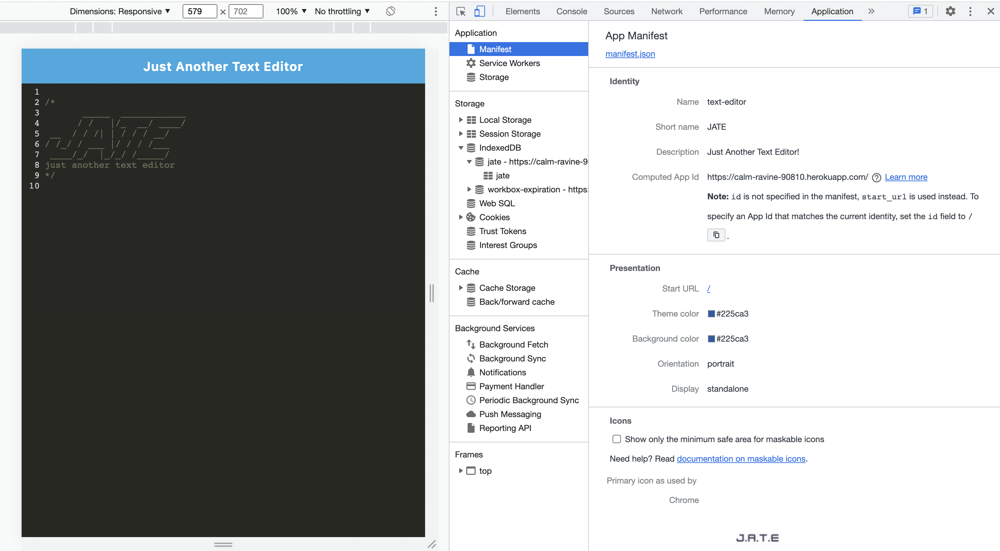
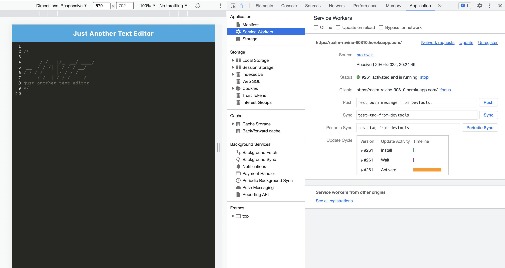

# PWA-TextEditor
Link to deployed application => 
  
## Table of Contents
- [Description](#description)

- [Installation](#installation)

- [Mock-Up](#Mock-Up)

- [Usage](#usage)

- [Contributors](#contributors)

## Description
Created a simple text editor app that can function both online and offline. Needed to use a variety of data persistence options in order to ensure that data is not lost in any scenario. The application first looks to use the data in the indexedDB to populate the editor, then if it cannot access that it will use local storage. For use offline, this application can be downloaded to your desktop as an application. This application is helpful to developers because they can use this as a scratch pad for code snippets and coding ideas. User story is below. 
  
## User Story

```md
AS A developer
I WANT to create notes or code snippets with or without an internet connection
SO THAT I can reliably retrieve them for later use
```

## Acceptance Criteria

```md
GIVEN a text editor web application
WHEN I open my application in my editor
THEN I should see a client server folder structure
WHEN I run `npm run start` from the root directory
THEN I find that my application should start up the backend and serve the client
WHEN I run the text editor application from my terminal
THEN I find that my JavaScript files have been bundled using webpack
WHEN I run my webpack plugins
THEN I find that I have a generated HTML file, service worker, and a manifest file
WHEN I use next-gen JavaScript in my application
THEN I find that the text editor still functions in the browser without errors
WHEN I open the text editor
THEN I find that IndexedDB has immediately created a database storage
WHEN I enter content and subsequently click off of the DOM window
THEN I find that the content in the text editor has been saved with IndexedDB
WHEN I reopen the text editor after closing it
THEN I find that the content in the text editor has been retrieved from our IndexedDB
WHEN I click on the Install button
THEN I download my web application as an icon on my desktop
WHEN I load my web application
THEN I should have a registered service worker using workbox
WHEN I register a service worker
THEN I should have my static assets pre cached upon loading along with subsequent pages and static assets
WHEN I deploy to Heroku
THEN I should have proper build scripts for a webpack application
```
  
## Installation
to install the dependencies for this project, the user simply needs to clone the repository and then run the command "npm install". This will install all necessary dependencies since they are all included in the package.json. 

## Mock-Up

The following image shows the application's `manifest.json` file:



The following image shows the application's registered service worker:



The following image shows the application's IndexedDB storage:


## Usage
To use this app, simply open it up in the browser (with the deployed app link at the top of this readme) and then you are good to go. For offline use, the user can go to the link and hit the "install" button at the top left corner of the page. 

## Contributors
Sorna Kesavan ©2022 All Rights Reserved.